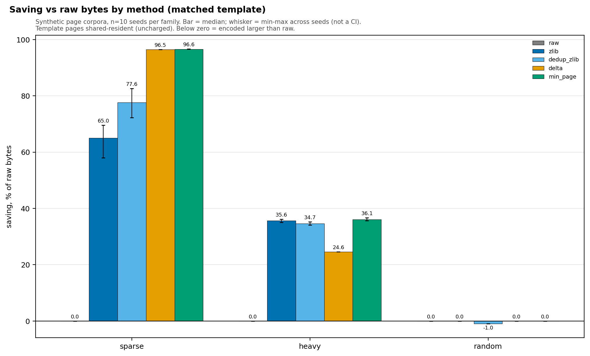
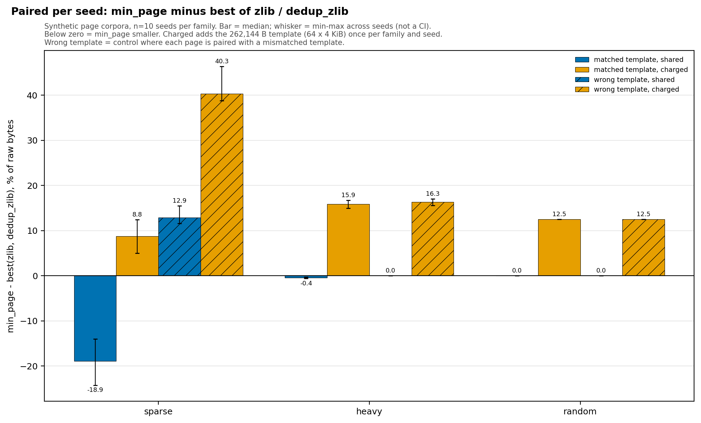

# Template Delta Lab

A reproducible compression lab for developers evaluating template-relative page storage. Compare raw storage, zlib, exact deduplication and block deltas on the same synthetic pages, including template-cost and mismatched-template controls.

**Status: research POC, suitable for local experiments.** Synthetic stored-byte accounting only; not OS memory savings or a full reproduction of [AgentZip](https://arxiv.org/html/2609.11294v1). Maintained by Gaille Amolong; an independent project, not an official implementation endorsed by the paper's authors.

On the frozen sparse family, min(raw, zlib, delta) saves a median **96.6005%** of private bytes versus **77.6488%** for exact dedup+zlib. But charge the full 256 KiB template to the POC and **it loses to the best baseline in all 10 seeds**. Heavy pages show a small shared-template advantage; random pages show none.

| Family | zlib saving | dedup+zlib saving | min_page saving | min_page saving with template charged |
|---|---:|---:|---:|---:|
| Sparse | 65.0306% | 77.6488% | 96.6005% | 69.6062% |
| Heavy | 35.6466% | 34.6701% | 36.0656% | 19.5472% |
| Random | 0% | -0.9766% | 0% | -12.5% |

Each cell is a median across 10 fixed seeds. Read [COMPARISON.md](COMPARISON.md) for paired deltas, ranges, wrong-template results, costs and limitations. Differences between these medians are not the paired statistics.





Whiskers show the seed range, **not a confidence interval**. The second chart subtracts the best baseline within each seed before aggregation; its denominator is raw bytes. Charging adds the full 262144-byte template, conservatively even when no delta is selected. [Full-size SVGs and figure hashes](docs/figures) · [Four-perspective readiness review](docs/READINESS.md).


Read the [technical walkthrough](docs/WALKTHROUGH.md) for the implementation, measured evidence, runnable examples and Mermaid diagrams. Proposed external integrations are labeled separately from implemented behavior.

## Run

Standard library only. Python 3.9+ runs the benchmark; **Python 3.12.0 / zlib 1.2.12** reproduces the recorded environment. No network, dataset download or API key.

```sh
python3 -m unittest test_poc test_verify_results -v
python3 verify_results.py
python3 poc.py --out results/replay/primary
python3 poc.py --wrong-template --out results/replay/wrong
python3 verify_results.py results/replay/primary results/replay/wrong
```

Output directories must be new or empty and inside this repository. A second identical command refuses to overwrite results. Expected: **17 passing tests** and verifier `status: passed` for two 450-row runs, with all 270 original baseline rows matching per run. Timings vary; compare byte counts and corpus hashes.

Runtime metadata differences are diagnostic; code/data hashes, corpus identity, byte counts, accounting and paired summaries remain strict checks. A different zlib that changes encoded bytes can still fail replay. `verify_results.py` checks committed results with no arguments and remains active under `python -O`; use normal Python for the benchmark tests.

To regenerate graphs, optionally install `matplotlib` in your own virtual environment, then run `python3 scripts/plot_results.py --out results/replay/figures`. Plotting verifies the committed artifacts first and refuses to overwrite an occupied directory. The committed manifest records the plotting version and input/output hashes; no plotting dependency is needed to run the experiment.

## Who this is useful for

- **Infrastructure developers:** assess when similarity to an already-resident template can beat a simple baseline, and when metadata or template retention erases the benefit.
- **Researchers and evaluators:** reproduce the declared byte model, inspect controls, and propose separately registered real-trace experiments.
- **Stakeholders:** use the negative charged-template result to decide whether an integration experiment is justified. This repo establishes no RAM reduction, density increase, speedup or cloud-cost saving.

## Design

4096-byte pages, 64-byte blocks, 64 template pages, eight synthetic sandboxes; 10 seeds and three timing repeats. Copy-on-write identical pages are excluded equally. Five methods see the same input: raw, per-page zlib with admission, exact dedup+zlib with index/reference costs, bitmap+verbatim-block delta, and per-page minimum of raw/zlib/delta. Wrong-template tests shift the reference for encoding and decoding together. No candidate is tuned after measurement.

A delta with two changed blocks costs 8 bytes of header + 8 bytes of bitmap + 128 bytes of changed blocks = 144 bytes. If an encoding does not save space, the page stays raw. [IMPLEMENTATION.md](IMPLEMENTATION.md) specifies template identity, tie order and modeled metadata. The template is free in the shared-resident scenario; the sensitivity charges all 262144 bytes to delta/min_page, including runs that select no deltas.

## Evidence

- [PREREGISTRATION.md](PREREGISTRATION.md): frozen before baseline measurements; hash retained unchanged.
- [DEVIATIONS.md](DEVIATIONS.md): header clarification and corrected interpreter invocation.
- [BASELINE.md](BASELINE.md) and [results/baseline](results/baseline): original three-method results.
- [results/poc](results/poc) and [results/poc-wrong-template](results/poc-wrong-template): 900 raw rows, paired summaries and provenance.
- [REVIEW.md](REVIEW.md): independent review and reproduction evidence.

Sixteen codec tests plus one verifier regression; 340590 page roundtrips per complete primary+control evaluation. The generator drives these results; none establish real memory usage, latency, sandbox capacity or a production benefit. Contributions and adoption gates are documented in [READINESS.md](docs/READINESS.md).

## Authorship, cost and license

Claude Opus 5.5 led paper selection and authored the codec and tests. Codex independently reviewed source, evaluation, claims, licensing and secrets, executed the experiment, and wrote the original artifact verifier and reports. Claude Opus 5.5 also authored the reviewed plotting and verifier-portability update. Local benchmark API spend is $0; Claude's cumulative list-price estimate is $4.0037460, not an invoice. Codex review/electricity are unmeasured.

Original code is [MIT](LICENSE), copyright 2026 Gaille Amolong. The referenced paper, arXiv:2609.11294v1, 10 September 2026, has its own CC BY-NC-ND 4.0 license. No paper prose, figures, upstream code, dataset or weights are redistributed.

The implementation and figures are original project artifacts; the underlying ideas are attributed to their source. A bounded public search cannot establish exclusive invention. Cite this repository with the exact commit you use and cite the paper separately.
