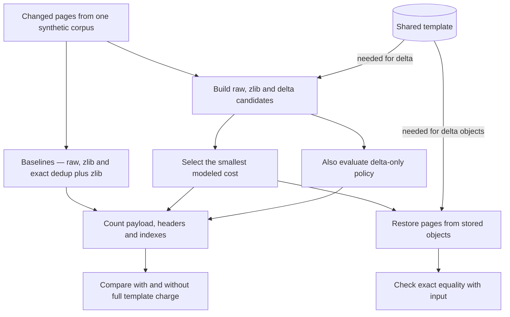

# How I Built a Python Lab to Test Whether Storing Only Changes Really Saves Space

*Compare compression, shared copies, and template deltas on the same data before committing to a more complicated storage design*

Suppose you are building a group of AI coding workers from the same starting environment. They load much of the same software, then change different parts of their memory as they work. You want to keep those workers isolated without keeping more copies of similar data than necessary.

There are several ways to approach that problem. Compress each copy. Store identical copies once. Or keep a common starting copy and record only what each worker changes. Choosing between them means comparing what each approach has to retain, including the original data needed to reconstruct the changes.

I built a proof of concept based on the template-delta technique in [Memory Compression for High-Fanout Agent Sandboxes (AgentZip), arXiv 2609.11294v1](https://arxiv.org/html/2609.11294v1) (Li et al., 2026). [Template Delta Lab](https://github.com/gael55x/template-delta-lab) (Amolong, 2026) is a small Python comparison tool that gives each method the same data, reconstructs every result, and counts the bytes required by its storage model.

The lab runs today on synthetic memory pages, small chunks of bytes representing what a worker might change. It does not manage a running worker’s RAM. Its useful output is a comparison you can reproduce before deciding whether a template-based design deserves an integration experiment. Below, I’ll run that comparison, explain the parts that produce it, and show why the template changes the decision.

## 1. Run the comparison and see what it returns

The lab needs only the standard library. From the repository root, these commands run the unit tests, both experiments into new directories and the independent verifier.

```sh
git clone https://github.com/gael55x/template-delta-lab
cd template-delta-lab
python3 -m unittest test_poc test_verify_results -v
mkdir -p results/replay
python3 poc.py --out results/replay/primary
python3 poc.py --wrong-template --out results/replay/wrong
python3 verify_results.py results/replay/primary results/replay/wrong
```

Seventeen unit tests should pass. The two experiment commands write raw measurements and summaries into separate directories; the verifier checks that they used identical inputs and followed the same byte accounting. The recorded environment is Python 3.12.0 with zlib 1.2.12. Different compression output can fail reproduction even when the code runs correctly, and raw timings will vary.

The first comparison to look at is the small-edit, or sparse, family. Per 100 raw bytes of changed pages, the selector kept a median 3.4 when the template was already shared. Deduplication plus compression kept 22.4. Charging the selector for the full template raised its total to 30.4. Those are modeled byte counts, not measurements of RAM or cloud savings. The rest of the tool exists to make that comparison reproducible and explain what drives it.

Open `results/replay/primary/summary.csv` to compare the sparse family’s shared and charged results. The [preregistration](https://github.com/gael55x/template-delta-lab/blob/main/PREREGISTRATION.md) records the frozen inputs and analysis, and the [comparison report](https://github.com/gael55x/template-delta-lab/blob/main/COMPARISON.md) explains the paired statistics and repeated measurements.

## 2. Put three storage choices on the same input

AgentZip targets many agent sandboxes forked from common templates. It combines several memory compression techniques and plans when to compress pages and when to bring them back. The part I isolated, from section 4.2.2, stores a page as its difference from the template page it started as. The paper's memory measure treats that template as shared and leaves it out of the total. That accounting is reasonable in its setting, where the template is already resident for other reasons.

The lab keeps only the template delta mechanism, with no kernel work, virtual machine or scheduling. It adds a question the paper's setting does not need to ask, which is what happens when the delta method must pay for keeping its template. This describes a different deployment, not a correction to the paper.

Memory is divided into pages, and the same page in two forked workers often looks nearly identical. There are three everyday ways to store such pages. You can compress each copy on its own. You can notice when two pages are exactly identical and keep a single shared copy. Or you can keep the original template page and store each worker's page as the few places where it differs.

In the lab, the first strategy is zlib applied to each page. The second is deduplication plus zlib, which hashes each page, confirms matches with a full byte comparison, stores each distinct page once and pays for index entries and reference counts. It is the strongest baseline on the sparse family, while plain zlib wins on the heavy and random inputs. Deduplication cannot merge pages that differ by a single byte, which is the gap the third strategy, the template delta, aims to fill.

The inputs are small and fixed. Every page is 4,096 bytes, split into 64 blocks of 64 bytes. Sixty-four template pages stand in for a base image, and eight simulated workers derive their pages from them. Sparse pages change two blocks and include exact duplicates, heavy pages change many more, and random pages hold unrelated data. Each family runs across ten fixed seeds. Pages identical to their template are treated as shared and excluded for every method. That is an accounting assumption rather than a measurement of copy-on-write state, since a real page can become private after a write even when its final bytes match. The comparison therefore covers changed pages, where every method faces the same choice.

## 3. Build a page from its original and its changes

The encoder compares a worker's page with its template block by block. It builds an 8-byte bitmap, one bit per block, marking which blocks differ, and appends the changed blocks in order. The modeled cost is an 8-byte header, the bitmap and 64 bytes per changed block. A page with two changed blocks therefore costs 8 + 8 + 128, or 144 bytes, against 4,096 raw. This example runs the lab's real codec from the repository root.

```python
from poc import BLOCK, PAGE, load_page, store_delta, stored_cost
original = bytes(PAGE)
changed = b'x' * BLOCK + b'y' * BLOCK + bytes(PAGE - 2 * BLOCK)
encoded = store_delta(changed, [original], 0)
print(stored_cost(encoded))
print(load_page(encoded, [original]) == changed)
```

It prints `144` and `True`, meaning the page is rebuilt exactly from the template plus two stored blocks. That demonstrates the codec rather than a winning result, because a page of mostly zeros like this one may compress even smaller with zlib.

The byte count includes a modeled 8-byte header for identifying and locating the stored representation. Its bit allocation is documented in [the implementation notes](https://github.com/gael55x/template-delta-lab/blob/main/IMPLEMENTATION.md). The lab has not implemented that header as a binary storage format.

## 4. Let the smallest valid representation win



*Figure 1. The implemented pipeline. Every method receives the same changed pages, the delta paths need the template, the selector keeps the cheapest candidate, and every restored page must match its input byte for byte.*


The delta-only method tries to encode each changed page against its template and keeps raw bytes when the delta would be larger. The selector in `poc.py` builds three stored forms of each changed page and keeps whichever the cost model counts as smallest. These functions come from the lab, and the encoder and accounting helpers they call live in the same file.

```python
def cheapest(candidates):
    """Lowest stored cost; min() keeps the first of equal costs, so pass candidates as raw, zlib, delta."""
    return min(candidates, key=stored_cost)


def store_min(page, template, j):
    return cheapest((('r', page), store_page(page), store_delta(page, template, j)))
```

`('r', page)` is the raw page. `store_page` tries zlib and `store_delta` tries a difference from template page `j`, and either keeps the page raw if encoding would not shrink it. `stored_cost` counts a raw page as 4,096 bytes or adds an 8-byte header to an encoded payload. `min` keeps the first tied candidate, so raw wins ties over zlib, then delta. Because zlib is always a candidate, the selector never stores a page larger than zlib would before any template charge. The full-template charge is applied later, outside this per-page choice. The chart's last two bars therefore show the selector, not delta-only storage.

## 5. Read the result with the template included


*Figure 2. Median stored bytes per 100 raw bytes of changed pages in the sparse family, across ten fixed seeds with eight simulated workers. Shorter bars are better. The last two bars use min_page, which chooses raw, zlib or delta for each page; they are not delta-only results. The last bar charges the full 256 KiB template to the selector. These are modeled stored bytes, not RAM use or money saved.*

For sparse pages, zlib alone kept 35.0 bytes per 100 raw and deduplication plus zlib kept 22.4. With the template treated as shared, the selector kept 3.4. That result follows from construction, since sparse pages change exactly two blocks.

The sensitivity run then charges the template, 64 pages of 4,096 bytes or 262,144 bytes, once per family and seed, to delta and the selector only. The selector rises to 30.4, now worse than deduplication plus zlib. For each seed, I subtracted the best baseline's total from the selector's total on identical input. With the template shared, the selector won all ten seeds by a median 18.9451 percentage points of raw bytes. With it charged, the selector lost all ten by a median 8.7833 points. Subtracting the chart's medians would suggest 8.0, which is why the lab computes paired differences per seed.

The other families show the charge matters even when the initial saving is small or absent. Heavy pages gave the selector a shared-template win of 0.449 points and a charged loss of 15.9071. Random pages stayed raw, deduplication added exactly 40 bytes of overhead per page, and the charge alone cost 12.5 points.

The charge is deliberately conservative. Following the preregistered whole-template scenario, it applies unconditionally, even when no delta is selected and a decoder would never need the template, as with random pages.

### Make sure the stored page comes back intact

A storage saving means nothing if a page comes back wrong. The decoder copies unchanged blocks from the template, fills in the stored ones and asserts that the stored data length matches the number of set bits. Every page from every method goes through a round trip and must equal its input exactly, and any mismatch aborts the run.

Encoded objects are trusted in-process tuples such as `('d', j, blob)`, produced and consumed only by `poc.py`. The index `j` names the template page to use, but nothing verifies that the page behind `j` holds the expected bytes. An index is a reference, not an identity. A real system would need versioned template identity and validation, which I propose rather than implement.

A wrong-template control asks what a poor reference costs. Each page derived from template i is encoded against template (i + 1) mod 64. Encoder and decoder both use the shifted index stored in the object, so every round trip still passes, and the control tests a worse reference choice rather than a corrupted restore. The selector's totals then matched zlib in every family. Sparse lost to deduplication plus zlib by a paired median of 12.8556 percent of raw bytes, while heavy and random tied their best baseline. In this control, losing the useful reference removed the delta’s advantage over ordinary compression.

## 6. Decide whether the saving justifies the extra machinery

The selector runs zlib and builds a delta for every page, so its smaller output comes with more encoding work. On sparse pages, the retained whole-corpus encode medians were 25.4842 ms for the selector, 21.7359 ms for zlib and 14.1304 ms for deduplication plus zlib. These timings are exploratory. Methods ran in a fixed order without explicit warmup, the figures include interpreter overhead and the machine was a shared laptop. They show that the extra work exists, not which method is fastest in a real system.

The decision turns on the template's incremental retention cost. If the template stays resident anyway, for instance because workers already share it, that cost may be zero and the shared scenario applies. If retaining it is a new cost, the accumulated saving on changed pages must exceed it. Selected representations that save 100 KiB against the best baseline while requiring another 256 KiB of template leave the overall decision unfavorable. Those figures are an illustration, not another benchmark result.

More workers can spread a fixed template cost across more useful deltas, but worker count alone is not enough. Their pages must stay similar to the template, and their lifetimes must overlap while it is retained. The extra CPU also needs a budget. Headers and indexes are already counted in the codec comparison and should not be charged twice. Temporary encoder buffers and runtime object allocations still need measurement before a byte-model result can inform any capacity recommendation, and future work would need real RAM measurements.

The codec accepts page bytes, but the CLI only generates synthetic inputs and has no snapshot importer or virtual machine hook. Figure 3 shows how an offline export could connect to the existing lab. The exporter, adapter and engine integration still need to be built.


*Figure 3. How an offline assessment would connect exported pages and their template to the lab before a later engine integration.*


The proposed contract is small. An export supplies changed pages. The template is immutable and versioned so an index always means the same bytes. A map records which template page each worker page came from. Exact restoration plus fewer modeled stored bytes after charging the full template would justify an engine experiment. That comparison still leaves out page tables, allocator slack, process overhead and encoding working memory. A deployment would further need a managed template lifecycle, a serialization format with checksums, real sandbox traces and end-to-end RAM and latency measurements.

## 7. Conclusion and how this helps you

Template Delta Lab gives you a repeatable way to test whether storing only the changes saves modeled space after accounting for the shared template. Each changed page competes against its raw and zlib forms. Deduplication plus zlib serves as a strong baseline, and the template is reported both as shared and as charged. On sparse synthetic pages, the selector wins clearly when the template is free and loses in every seed when it must be paid for.

To apply this to your own workload, run the tests and primary experiment from a fresh clone. Pick the input family closest to the page pattern you expect, and compare the shared and charged totals against the better of zlib and deduplication plus zlib. Then estimate whether your template would stay resident anyway, how similar your workers' pages remain and how long they overlap. Those answers tell you whether an offline export along the lines of Figure 3 is worth building.

## References

Amolong, G. (2026). *Template delta lab* (Version f25d084) [Computer software]. GitHub. [https://github.com/gael55x/template-delta-lab/tree/f25d0844dd9efe8bde3ceed0f03e3c35206bffad](https://github.com/gael55x/template-delta-lab/tree/f25d0844dd9efe8bde3ceed0f03e3c35206bffad)

Li, M., Xu, C., Zhang, Q., Yu, J., Sun, X., Mai, H., & Xie, Z. (2026). *Memory compression for high-fanout agent sandboxes* [Preprint]. arXiv. [https://doi.org/10.48550/arXiv.2609.11294](https://doi.org/10.48550/arXiv.2609.11294)
