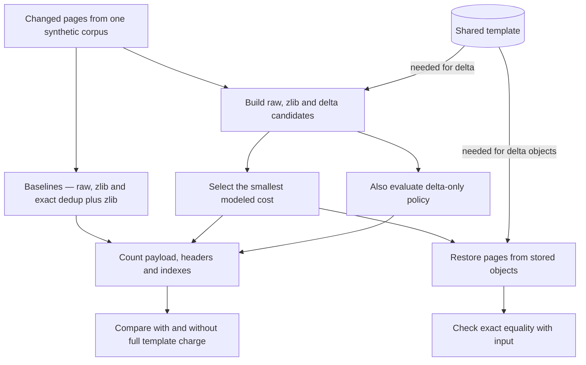
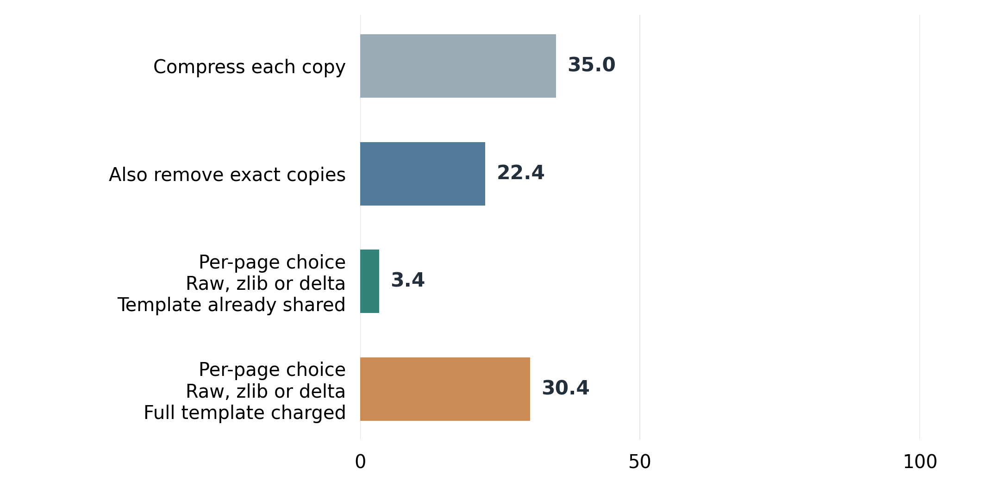
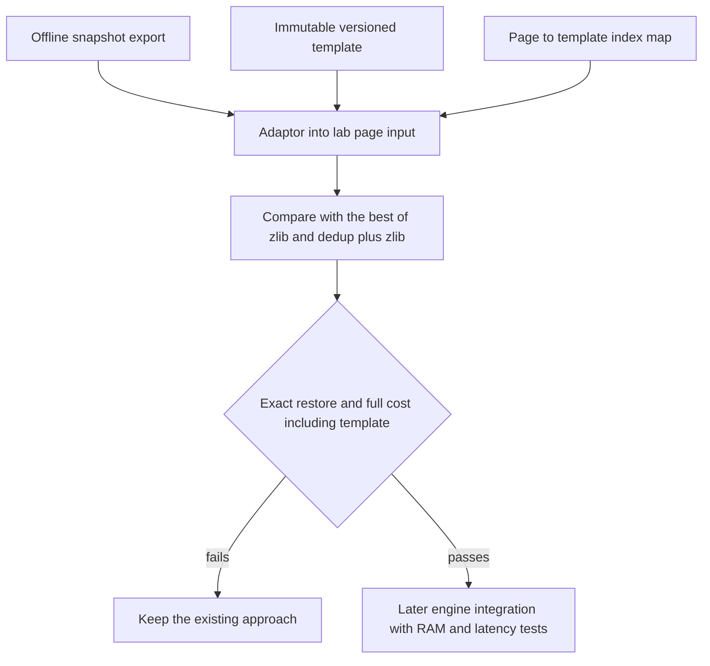

# Why Storing Only the Changes Can Still Use More Space

*Following one changed page and its shared template through encoding, selection, restore and the final cost decision*

Eight AI coding workers start from the same base image. One fixes a bug, one runs tests, one reviews a change. Each needs isolated memory, yet most of what they load is identical. Now suppose one worker writes into a 4,096-byte page and changes two of its 64-byte blocks. The page no longer matches the original, so it cannot simply be shared. Storing only those two blocks sounds like an easy win.

This article follows that changed page, and the template it came from, through encoding, selection, exact restore and the final cost decision. The research starting point is [Memory Compression for High-Fanout Agent Sandboxes (AgentZip), arXiv 2609.11294v1](https://arxiv.org/html/2609.11294v1). I built a proof of concept based on the paper, and the code is in [Template Delta Lab](https://github.com/gael55x/template-delta-lab). The AI workers motivate the problem, but my input is synthetic pages generated in Python, not memory captured from a live virtual machine.

In the small-edit comparison, the selector wins when the template is already resident. Charging for that template reverses the result in all ten seeds. Following the bytes through the implementation explains both outcomes—and gives infrastructure teams a better question to ask before attempting an integration.

## 1. What AgentZip proposes and what I tested

AgentZip targets many agent sandboxes forked from common templates. It combines several memory compression techniques and plans when to compress pages and when to bring them back. The idea I worked from, in section 4.2.2, stores a page as its difference from the template page it began as. The paper's memory measure treats that common template as shared and leaves it out of the total.

My proof of concept isolates the template delta mechanism offline in standard-library Python and counts modeled stored bytes. There is no kernel work, no virtual machine and no scheduling. I added a question the paper's setup does not need to ask, namely what happens when the delta method must pay for keeping the template. That explores a different deployment, not an error in the paper. I froze the inputs and analysis plan in a preregistration before running the first baseline.

## 2. The synthetic setup

Every page is 4,096 bytes, split into 64 blocks of 64 bytes. There are 64 template pages, standing in for a shared base image, and eight simulated workers derive their pages from them. Three input families cover the range. Sparse pages change two blocks and include exact duplicates. Heavy pages change much more. Random pages hold unrelated data with little in common with any template. Each family runs across ten fixed seeds, so a rerun produces the same bytes, and every configuration repeats three times for timing.

The model treats pages identical to their template as already shared and excludes them for every method. This is an accounting assumption, not a measurement of a runtime’s actual copy-on-write state. A real page could become private after a write even if its final bytes match the template. What remains in this comparison are changed pages, where each method faces the same storage decision.

## 3. Encoding the changed page

The encoder compares the worker's page with its template block by block. It builds an 8-byte bitmap, one bit per block, marking which blocks differ, and appends the changed blocks in order. The modeled cost is an 8-byte header, the 8-byte bitmap and 64 bytes per changed block, so two changed blocks cost 8 + 8 + 128, or 144 bytes, against 4,096 for the raw page. This example uses the lab's real codec from the repository root.

```python
from poc import BLOCK, PAGE, load_page, store_delta, stored_cost
original = bytes(PAGE)
changed = b'x' * BLOCK + b'y' * BLOCK + bytes(PAGE - 2 * BLOCK)
encoded = store_delta(changed, [original], 0)
print(stored_cost(encoded))
print(load_page(encoded, [original]) == changed)
```

It prints `144` and `True`, so the page is restored exactly from the template plus two stored blocks. This demonstrates the codec rather than a winning benchmark, because a page of mostly zeros like this one may compress even smaller with zlib. Making that comparison for every page is the selector's job.

The header is an accounting model, not a wire format. Its 64 bits are budgeted as 2 for a codec tag, 12 for length, 6 for the template index and 44 for location, so the index costs nothing beyond the 8 bytes. In code, encoded objects are trusted in-process tuples such as `('d', j, blob)`, produced and consumed only by `poc.py`. The template index `j` is explicit, but nothing verifies that the template behind `j` holds the expected content. A real system would need versioned template identity and validation, which I propose rather than implement.

## 4. Choosing the cheapest form for each page



*Figure 1. The implemented pipeline. Every method receives the same changed pages, the delta paths need the template, the selector keeps the cheapest candidate, and every restored page must match its input byte for byte.*


The selector, `min_page`, builds three candidates for every page in a fixed order, raw, zlib at level 9 and delta, and keeps the lowest stored cost. When two candidates tie, Python's `min` keeps the first, so raw beats zlib and zlib beats delta at equal cost. A compressed or delta form is admitted only if it is smaller than a raw page. A delta can therefore hold at most 63 changed blocks, at 4,048 bytes, while 64 changed blocks would cost 4,112 and stay raw. Because the selector runs every encoder on every page, its storage advantage comes with extra CPU.

A separate baseline combines exact deduplication with zlib. It is the strongest baseline on the sparse family, while ordinary zlib wins on the heavy and random inputs. It hashes each page, confirms matches with a full byte comparison, stores each distinct page once and pays for its index entries and reference counts. It cannot merge pages that differ by a single byte, which is exactly the gap the delta is meant to fill.

## 5. Restoring exactly and checking the reference

A storage saving means nothing if the page comes back wrong. The decoder copies unchanged blocks from the template, fills in the stored ones and asserts that the blob length matches the number of set bits. Every page from every method goes through a round trip and must equal its input exactly, and any mismatch aborts the run.

A separate control asks what happens when the reference is poor. In the wrong-template run, each page derived from template i is encoded against template (i + 1) mod 64. Encoder and decoder both use the shifted index stored in the object, so every round trip still passes. This tests a worse reference choice, not a corrupted restore. The selector's totals then matched zlib in every family, so sparse lost to dedup plus zlib by a paired median of 12.8556 percent of raw bytes, while heavy and random tied their best baseline. The quality of the reference determines whether the delta adds value beyond ordinary compression.

## 6. The cost decision when the template is counted



*Figure 2. Median stored bytes per 100 raw bytes of changed pages in the sparse family, across ten fixed seeds with eight simulated workers. Shorter bars are better. The last bar charges the full 256 KiB template to the selector. These are modeled stored bytes, not RAM use or money saved.*

For sparse pages, zlib alone kept 35.0 bytes per 100 raw, and dedup plus zlib kept 22.4. The selector kept 3.4 when the template was treated as already shared. That result follows from construction, since sparse pages change exactly two blocks.

The sensitivity run then charges the template, 64 pages of 4,096 bytes or 262,144 bytes, once per family and seed, to delta and the selector only. The selector rises to 30.4, now worse than dedup plus zlib. The paired numbers make this sharper. For each seed I subtract the best baseline's total from the selector's total on identical input. With the template shared, the selector won all ten seeds by a median 18.9451 percentage points of raw bytes. Charged, it lost all ten by a median 8.7833 points. Subtracting the chart's medians would give 8.0, which is why paired statistics are computed per seed.

The other families show the same reversal. Heavy pages gave the selector a tiny shared-template win of 0.449 points and a charged loss of 15.9071. Random pages stayed raw, dedup added exactly 40 bytes of overhead per page, and the charge alone cost 12.5 points.

The charge is conservative on purpose. It applies even when no delta is selected, as with random pages, where a decoder would not need the template. That follows the preregistered whole-template scenario. The paper measures a world where the template is already resident for other reasons, and in that world its accounting is reasonable.

## 7. What the selector costs in CPU

On sparse pages, the retained whole-corpus encode medians were 25.4842 ms for the selector, 21.7359 ms for zlib and 14.1304 ms for dedup plus zlib. The selector does more encoding work because it runs zlib and builds a delta for every page; it was slower in this retained run. These numbers are exploratory. Methods ran in a fixed order without explicit warmup, timings include interpreter overhead and the machine was a shared laptop. They show that the extra work exists, not which method is fastest in a real system.

## 8. Using the lab before an integration

The practical value is a cost decision made before anyone touches a sandbox engine. If a team expects many workers to make small edits from the same template, the lab shows whether full cost, template included, beats the better of zlib and deduplication plus zlib for that page pattern, and whether the template is truly free because it is already kept for another reason. If it is not, the sparse result says that simple deduplication may be the better choice.

A useful break-even question is whether the accumulated saving on changed pages exceeds the extra cost of retaining their template. If the selected representations save 100 KiB compared with the best baseline but require another 256 KiB of template, the overall storage decision is unfavorable. These numbers are an illustrative calculation, not another benchmark result. If the template would remain resident anyway, its additional retention cost may instead be zero. That is why the two accounting scenarios answer different questions.

More workers could spread a fixed template cost across more useful deltas, but worker count alone is not enough. Their pages need to stay similar, and their lifetimes need to overlap while that template is retained. A team should measure those conditions in its own workload. Headers and indexes already counted in the codec comparison should not be charged twice. Temporary encoder buffers and the runtime’s own object allocations still need separate measurement before translating a byte-model result into a capacity recommendation.

The codec accepts page bytes, but the CLI generates synthetic inputs and has no snapshot importer or virtual machine hook. The path below is a proposal for a future offline assessment.



*Figure 3. How an offline assessment would connect exported pages and their template to the lab before a later engine integration.*


The contract is small. The export supplies changed pages, the template must be immutable and versioned so an index always means the same bytes, and the map says which template page each worker page came from. Only a pass on exact restore and full cost would justify engine work. A deployment would then need a managed template lifecycle, a real serialization format with checksums, real sandbox traces and end-to-end measurements of RAM and latency, none of which is implemented here. Resident memory, latency and worker capacity remain unmeasured, so this lab shows no real RAM or cloud savings.

## 9. Reproduce it and the next experiment

The lab uses only the standard library. From the repository root, run the tests, both experiments into new directories and the independent verifier.

```sh
git clone https://github.com/gael55x/template-delta-lab
cd template-delta-lab
python3 -m unittest test_poc test_verify_results -v
mkdir -p results/replay
python3 poc.py --out results/replay/primary
python3 poc.py --wrong-template --out results/replay/wrong
python3 verify_results.py results/replay/primary results/replay/wrong
```

Seventeen unit tests should pass. Each full run writes 450 rows and performs 170,295 page round trips, so both runs together give 900 rows and 340,590 round trips. Those rows include three timing repeats per configuration, so they are not 900 independent workloads. The recorded environment is Python 3.12.0 with zlib 1.2.12. The verifier treats runtime versions as diagnostics while enforcing code and data hashes, input identity and byte accounting. Different compression output can still fail reproduction. Raw timings are expected to vary.

The next experiment I would run is the offline path in Figure 3 with real exported pages, a fixed template and an index map, applying the same paired comparison and the same template charge. If the selector cannot beat the better of zlib and deduplication plus zlib once its template is paid for, the right answer is to stop before engine work. The decision should follow the complete retained cost, including what the changes depend on. A small delta by itself is not the whole result.

